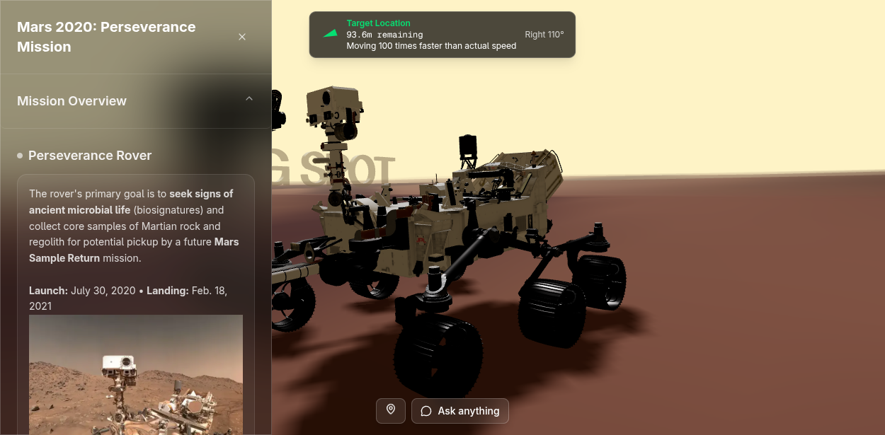
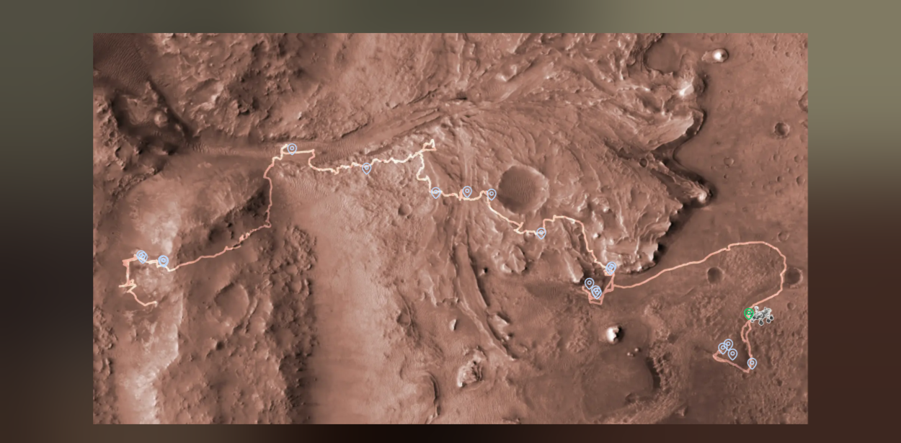
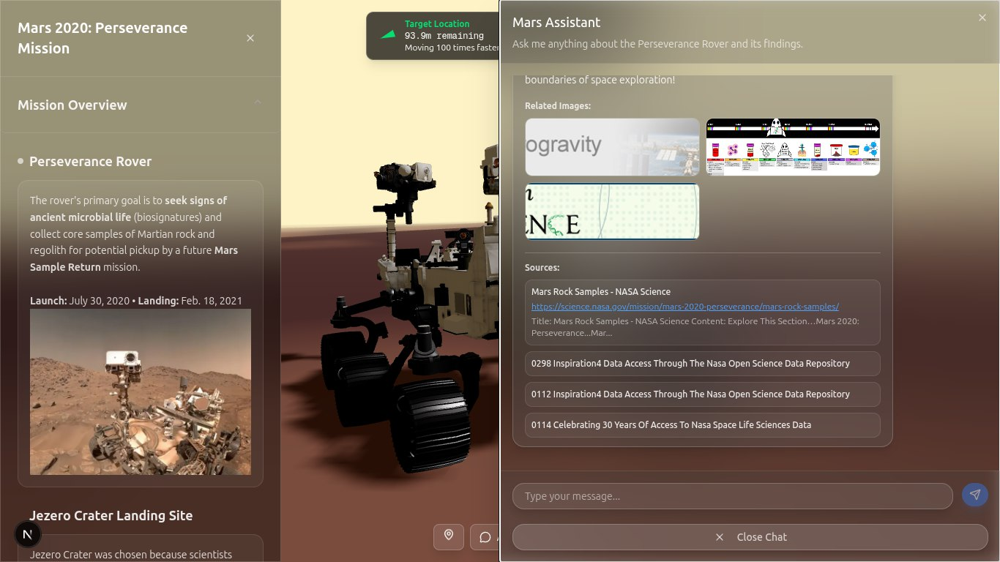

# NASA Space App Challenge - AI Assistance Chatbot

Deployed: https://3js-test-theta.vercel.app/

## Project Overview

NASA SpaceX AI Assistance Chatbot is an intelligent research assistant that provides context-aware answers about space research, missions, and experiments using Retrieval-Augmented Generation (RAG) technology.

## Screenshots







## Backend

### How to Run the Backend

1.  **Prerequisites:**
    *   Python 3.8 or higher
    *   Git (optional)

2.  **Setup Environment:**
    ```bash
    pip install -r requirements.txt
    ```

3.  **Configure Environment Variables:**
    Edit `.env` file with your API keys:
    *   `GEMINI_API_KEY=your_google_gemini_api_key`
    *   `PINECONE_API_KEY=your_pinecone_api_key`
    *   `PINECONE_ENVIRONMENT=your_pinecone_environment`
    *   `PINECONE_INDEX_NAME=your_index_name`

4.  **Start the Backend Server:**
    ```bash
    cd backend
    python -m uvicorn main:app --reload
    ```

5.  **Access the API:**
    *   Backend API: http://localhost:8000
    *   API Documentation: http://localhost:8000/docs
    *   Health Check: http://localhost:8000/api/v1/health

### Architecture & Features

*   **Architecture:** FastAPI backend, Google Gemini AI, Pinecone vector database, NASA OSDR API integration, SQLite database.
*   **Core Features:** Intelligent chat interface, Dual search (Vector DB + NASA OSDR), Topic extraction, Source attribution.
*   **Technology Stack:** FastAPI, Google Gemini 2.5 Flash, Pinecone, SQLite, NASA OSDR.

### API Endpoints

*   `POST /api/v1/chat` - Send message and get AI response
*   `GET /api/v1/chat/sessions` - Get all chat sessions
*   `POST /api/v1/chat/sessions` - Create new chat session
*   `GET /api/v1/chat/sessions/{session_id}/history` - Get chat history
*   `DELETE /api/v1/chat/sessions/{session_id}` - Delete chat session
*   `GET /api/v1/health` - Health check endpoint

---

## Frontend

This is a [Next.js](https://nextjs.org) project bootstrapped with [`create-next-app`](https://nextjs.org/docs/app/api-reference/cli/create-next-app).

### Getting Started

First, run the development server:

```bash
npm i
npm run dev
# or
yarn dev
# or
pnpm dev
# or
bun dev
```

Open [http://localhost:3000](http://localhost:3000) with your browser to see the result.


You can start editing the page by modifying `app/page.tsx`. The page auto-updates as you edit the file.

This project uses [`next/font`](https://nextjs.org/docs/app/building-your-application/optimizing/fonts) to automatically optimize and load [Geist](https://vercel.com/font), a new font family for Vercel.

### Learn More

To learn more about Next.js, take a look at the following resources:

*   [Next.js Documentation](https://nextjs.org/docs) - learn about Next.js features and API.
*   [Learn Next.js](https://nextjs.org/learn) - an interactive Next.js tutorial.

You can check out [the Next.js GitHub repository](https://github.com/vercel/next.js) - your feedback and contributions are welcome!

### Deploy on Vercel

The easiest way to deploy your Next.js app is to use the [Vercel Platform](https://vercel.com/new?utm_medium=default-template&filter=next.js&utm_source=create-next-app&utm_campaign=create-next-app-readme) from the creators of Next.js.

Check out our [Next.js deployment documentation](https://nextjs.org/docs/app/building-your-application/deploying) for more details.
